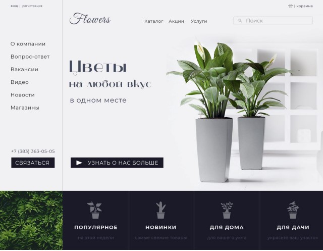

# Тестовое задание Altbar
## Задача
Собрать макет блока страницы любым удобным способом, ориентируясь лишь на
картинку (можно в т.ч. и на React’e).\
Большим плюсом будет продумывание функционала: анимация, заглушка корзины и т.д.

## Результат
### [ссылка на gh-pages](http://isildurrr1.github.io/flowers)
## Стек технологий

\

